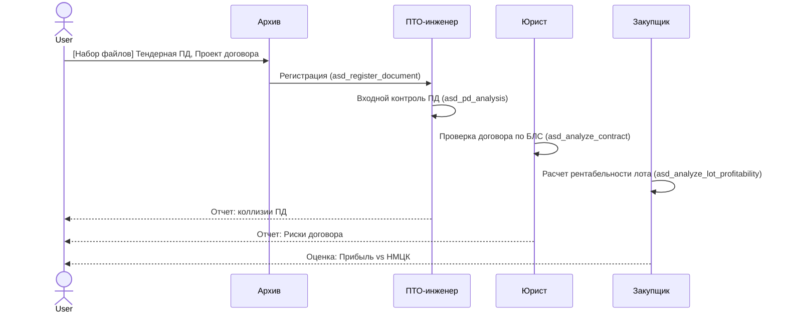
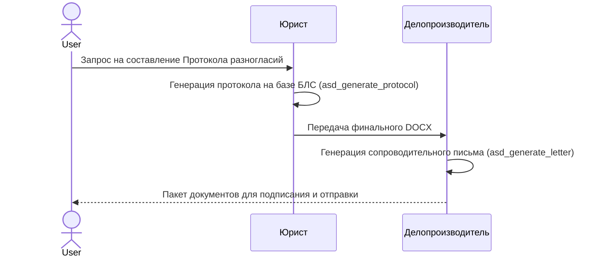
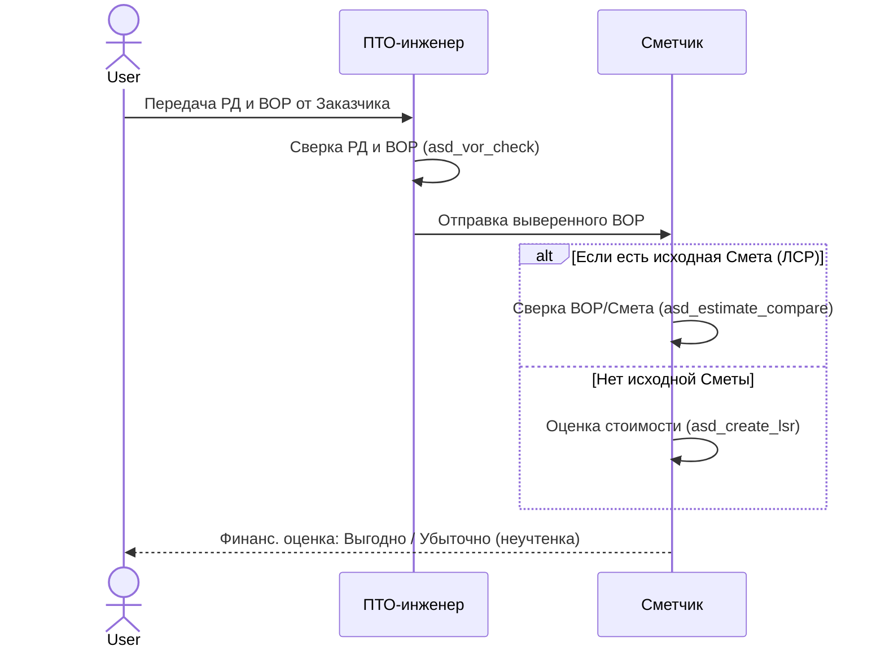
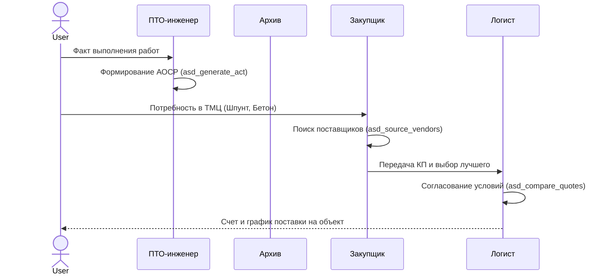
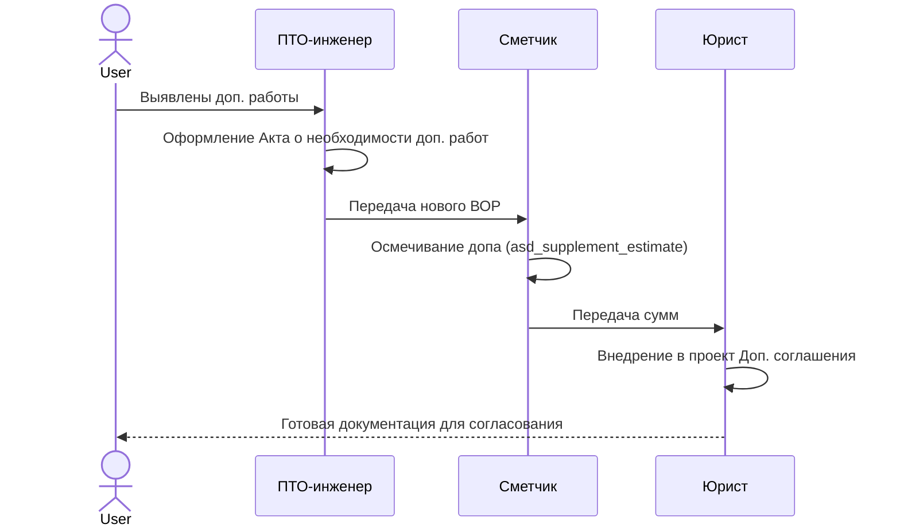
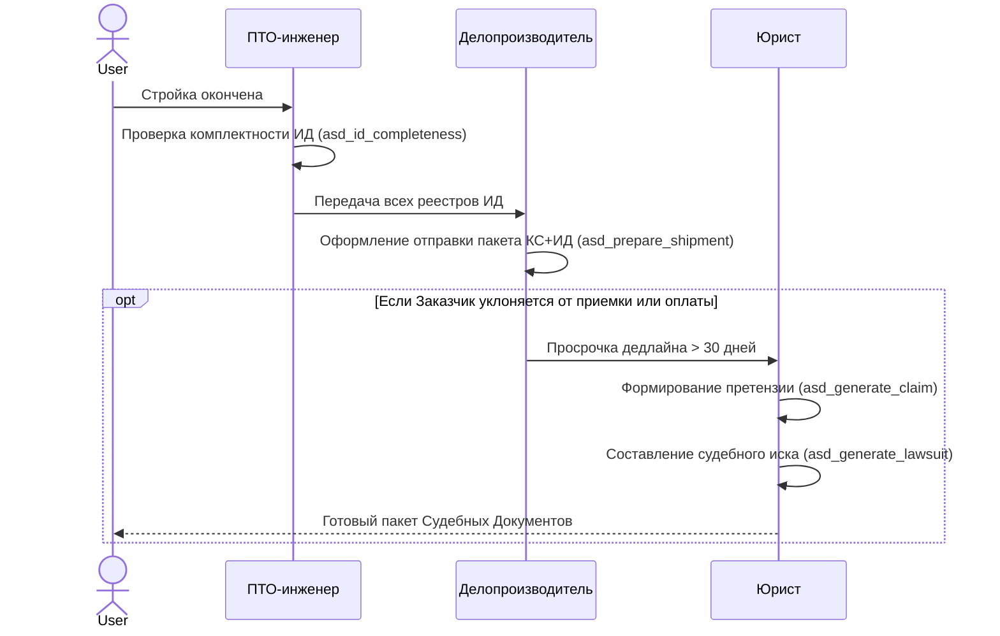

# Жизненный цикл строительства: ASD Workflow

Данный документ описывает строгий конвейер документооборота и распределение обязанностей между 7 агентами (Гермес, Юрист, ПТО, Сметчик, Закупщик, Логист, Архив) на протяжении 6 реальных этапов строительства объекта. 
Система выстроена так, чтобы минимизировать риски Подрядчика/Субподрядчика путем своевременного включения специализированного агента.

---

## Фаза 1: Тендер и Предквалификация (Анализ входа)

На старте Подрядчик получает "кота в мешке": исходную проектную документацию (ПД) и проект договора. Задача этой фазы — оценить целесообразность участия и выявить фатальные ошибки Генподрядчика.

**Ключевые инструменты (MCP):**
- ПТО: `asd_pd_analysis` (поиск пересечений, несоответствий СНиП/ГОСТ в проекте).
- ЮРИСТ: `asd_analyze_contract` (жесткая проверка тендерного договора на предмет ловушек, например, безусловных банковских гарантий).

---

## Фаза 2: Договорная кампания (Заключение договора)

После победы в тендере необходимо отстоять свои интересы: подписать договор не "как есть", а с протоколом разногласий.

**Ключевые инструменты (MCP):**
- ЮРИСТ: `asd_generate_protocol` (создание документа с формулировками, снижающими риски).
- ДЕЛОПРОИЗВОДИТЕЛЬ: `asd_generate_letter` (формирование официального сопроводительного письма со ссылками на статьи ГК РФ).

---

## Фаза 3: Подготовка производства (ВОР и РД)

Договор подписан, "стройка на бумаге". Выдается Рабочая Документация (РД) со штампом "В производство работ" и Ведомость Объемов Работ (ВОР). Здесь кроется большинство финансовых потерь из-за неучтенных объемов.

**Ключевые инструменты (MCP):**
- ПТО: `asd_vor_check` (построчное сравнение длин, площадей из РД с перечнем в ВОР).
- СМЕТЧИК: `asd_estimate_compare` (выявление работ, указанных в ВОР, но забытых в Локальной смете).

---

## Фаза 4: Производство СМР (Активные работы)

Стройка идет. Главная задача Субподрядчика — документировать каждый свой шаг, чтобы впоследствии доказать объем и качество. Если Заказчик не подписывает акты, нужно фиксировать документальный след.

**Ключевые инструменты (MCP):**
- ПТО: `asd_generate_act` (генерация Актов Освидетельствования Скрытых Работ по регламенту).
- ДЕЛОПРОИЗВОДИТЕЛЬ: `asd_track_deadlines` (контроль 3-5 дневного срока ответа Заказчика по актам).

---

## Фаза 5: Неучтённые / Дополнительные объемы (Доп. соглашения)

На каждом объекте всплывают работы, которых не было в РД. Если Субподрядчик сделает их без согласования — он не получит денег (ст. 743 ГК РФ).

**Ключевые инструменты (MCP):**
- СМЕТЧИК: `asd_supplement_estimate` (расчет стоимости доп. работ по действующим индексам/расценкам текущего контракта).
- ЮРИСТ: Экспертиза допсоглашения на предмет отсутствия пункта о «безвозмездности».

---

## Фаза 6: Сдача объекта и Претензионная работа

Строительство завершено. Задача — передать ИД (Исполнительную Документацию), Акты (КС-2, КС-3) и получить деньги. Если Заказчик не платит, в дело вступает "Тяжелая артиллерия".

**Ключевые инструменты (MCP):**
- ПТО: `asd_id_completeness` (сопоставление финальных реестров ИД с требованиями ГОСТ Р).
- ДЕЛОПРОИЗВОДИТЕЛЬ: `asd_prepare_shipment` (закрепление юридически значимого факта передачи КС-2/КС-3 ценным письмом с описью).
- ЮРИСТ: `asd_generate_claim` и `asd_generate_lawsuit` (автоматическое извлечение сумм и дат из договора, пеней и формирование процессуальных документов для Арбитража).
