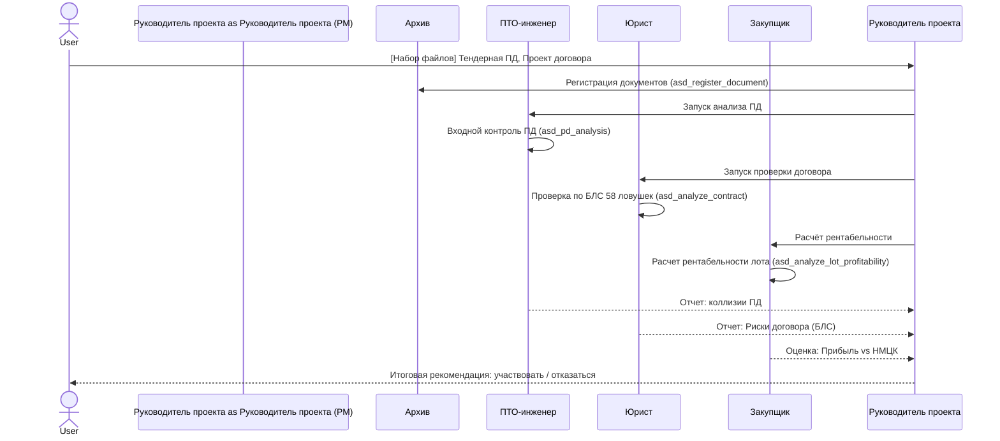
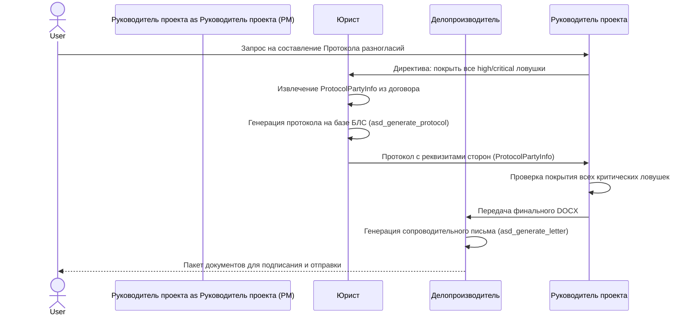
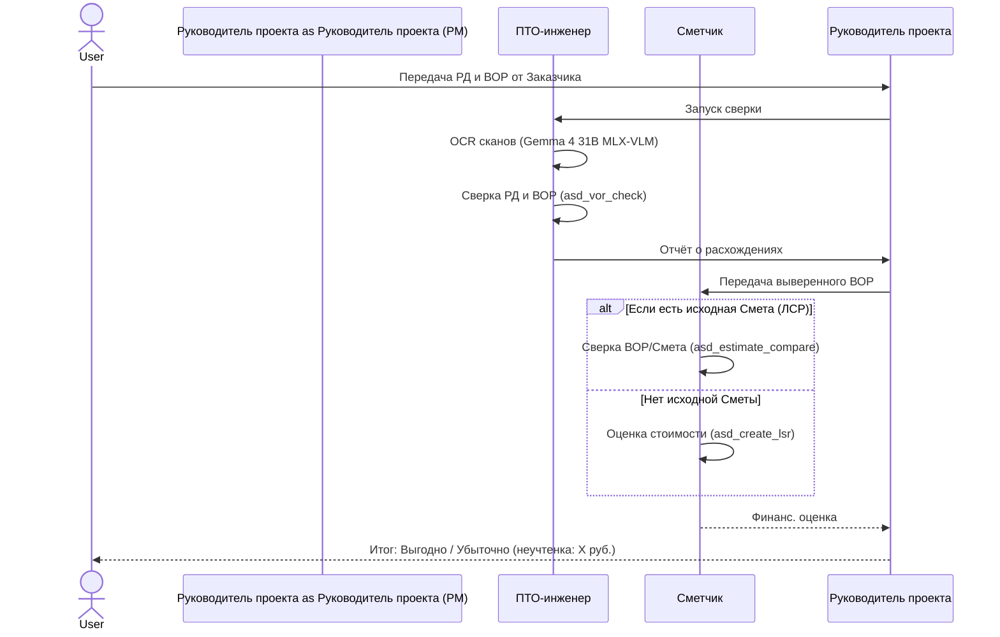
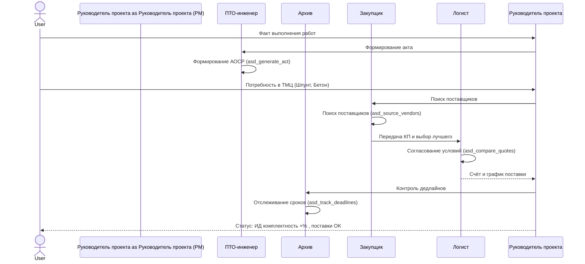
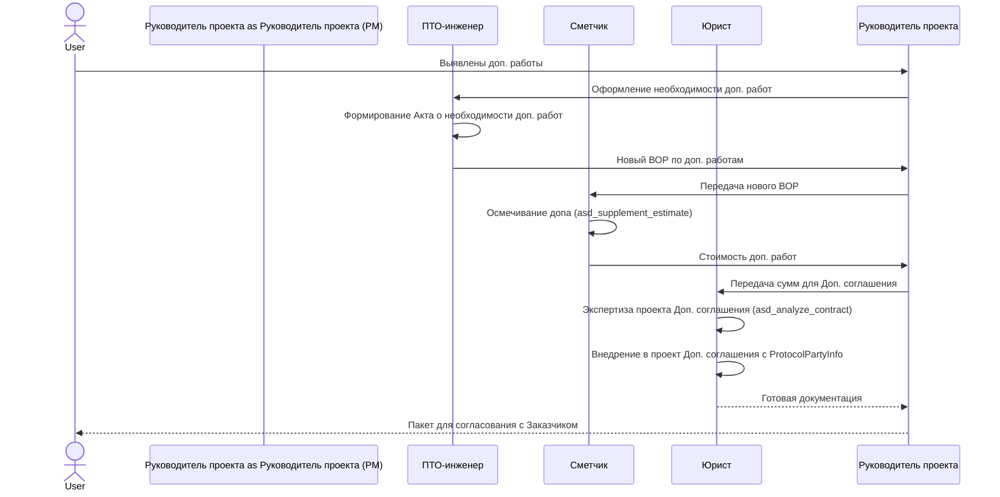
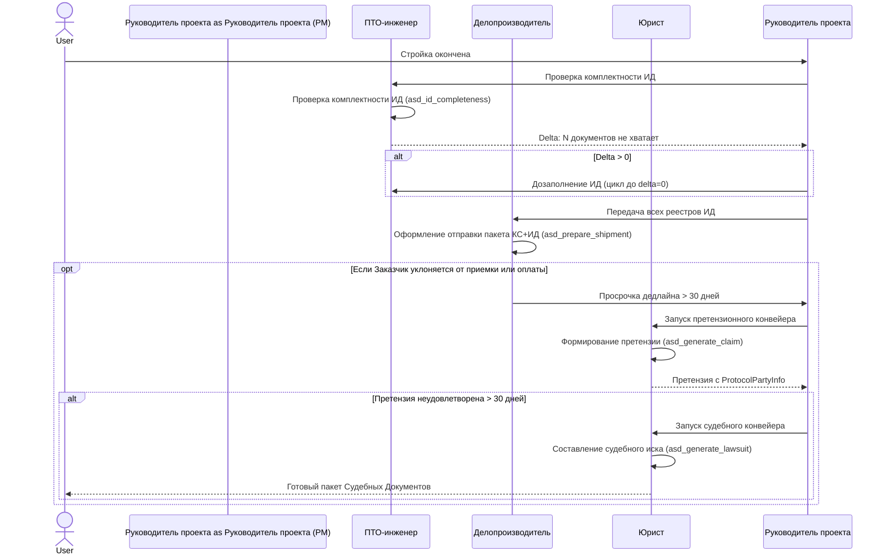

# АСД v11.3 — Жизненный цикл строительства: ASD Workflow

**Дата:** 20 апреля 2026
**Версия:** v11.3

---

## Стратегический контекст: АСД как мобильный автономный офис антикризисного управления

Архитектурная система документооборота (АСД) v11.3 спроектирована как **мобильный автономный офис антикризисного управления** для строительного подрядчика. В условиях строительного кризиса — когда Заказчик задерживает оплату, Генподрядчик перекладывает риски, а документооборот ведётся хаотично — АСД обеспечивает непрерывный документальный след, своевременное выявление ловушек и автоматическую генерацию процессуальных документов. Система работает полностью автономно на Mac Studio M4 Max 128GB без зависимости от облачных сервисов, что критично в условиях нестабильной связи на строительных площадках.

Все пять рабочих агентов (Юрист, ПТО, Сметчик, Закупщик, Логист) работают через модель **Gemma 4 31B 4-bit** (MLX-VLM, 128K контекст) с разделяемой памятью, Делопроизводитель использует **Gemma 4 E4B 4-bit** (8K контекст), а **Руководитель проекта (PM)** на базе **Llama 3.3 70B 4-bit** выступает не просто как маршрутизатор, а как **руководитель**, активно направляющий процесс к нулевому delta в комплектности исполнительной документации. Gemma 4 31B (MLX-VLM) обеспечивает встроенную vision-поддержку для OCR сканов.

---

Данный документ описывает строгий конвейер документооборота и распределение обязанностей между 7 агентами (Руководитель проекта, Юрист, ПТО, Сметчик, Закупщик, Логист, Делопроизводитель) на протяжении 6 реальных этапов строительства объекта.
Система выстроена так, чтобы минимизировать риски Подрядчика/Субподрядчика путем своевременного включения специализированного агента.

---

## Фаза 1: Тендер и Предквалификация (Анализ входа)

На старте Подрядчик получает «кота в мешке»: исходную проектную документацию (ПД) и проект договора. Задача этой фазы — оценить целесообразность участия и выявить фатальные ошибки Генподрядчика. АСД работает как фильтр: отсекает заведомо убыточные лоты и договоры с критическими ловушками БЛС. Все агенты на этой фазе используют Gemma 4 31B через LLMEngine, а Руководитель проекта (Llama 3.3 70B) координирует порядок действий и оценивает общую картину рисков.

**Ключевые инструменты (MCP):**
- ПТО: `asd_pd_analysis` (поиск пересечений, несоответствий СНиП/ГОСТ в проекте; OCR сканов через vision-возможности Gemma 4 31B MLX-VLM).
- ЮРИСТ: `asd_analyze_contract` (жёсткая проверка тендерного договора на предмет 58 ловушек БЛС в 10 категориях; Gemma 4 31B с 128K контекстом — большинство договоров помещаются целиком без Map-Reduce).
- ЗАКУПЩИК: `asd_analyze_lot_profitability` (расчёт рентабельности с учётом неучтённых объёмов из отчёта ПТО).
- HERMES: Координация агентов, агрегация оценок рисков, принятие стратегического решения.

---

## Фаза 2: Договорная кампания (Заключение договора)

После победы в тендере необходимо отстоять свои интересы: подписать договор не «как есть», а с протоколом разногласий. Это критический этап — пропущенная ловушка здесь обернётся финансовыми потерями на всей стройке. Юрист генерирует протокол разногласий с автозаполнением формулировок из БЛС и полными реквизитами сторон (ProtocolPartyInfo), извлечёнными из текста договора. Руководитель проекта контролирует полноту покрытия всех выявленных рисков.

**Ключевые инструменты (MCP):**
- ЮРИСТ: `asd_generate_protocol` (создание DOCX-документа с формулировками, снижающими риски; включение полного блока ProtocolPartyInfo — наименования, ИНН, ОГРН, адреса, расчётные счета, подписанты).
- ДЕЛОПРОИЗВОДИТЕЛЬ: `asd_generate_letter` (формирование официального сопроводительного письма со ссылками на статьи ГК РФ и реквизитами из ProtocolPartyInfo).
- HERMES: Валидация полноты покрытия — все ли ловушки с severity ≥ high отражены в протоколе.

---

## Фаза 3: Подготовка производства (ВОР и РД)

Договор подписан, «стройка на бумаге». Выдаётся Рабочая Документация (РД) со штампом «В производство работ» и Ведомость Объёмов Работ (ВОР). Здесь кроется большинство финансовых потерь из-за неучтённых объёмов. ПТО-инженер сверяет РД с ВОР через Gemma 4 31B, а при обнаружении сканированных листов автоматически использует vision-возможности MLX-VLM для OCR. Сметчик оценивает финансовые последствия расхождений. Руководитель проекта отслеживает delta между ожидаемой и реальной стоимостью.

**Ключевые инструменты (MCP):**
- ПТО: `asd_vor_check` (построчное сравнение длин, площадей из РД с перечнем в ВОР; fuzzy matching для наименований работ).
- СМЕТЧИК: `asd_estimate_compare` (выявление работ, указанных в ВОР, но забытых в Локальной смете).
- СМЕТЧИК: `asd_create_lsr` (создание ЛСР по ВОР при отсутствии исходной сметы).

---

## Фаза 4: Производство СМР (Активные работы)

Стройка идёт. Главная задача Субподрядчика — документировать каждый свой шаг, чтобы впоследствии доказать объём и качество. Если Заказчик не подписывает акты, нужно фиксировать документальный след. АСД выступает как система непрерывного контроля: ПТО генерирует акты, Делопроизводитель отслеживает дедлайны ответов, Закупщик и Логист обеспечивают поставки. Руководитель проекта отслеживает delta в комплектности ИД и инициирует действия для его сокращения.

**Ключевые инструменты (MCP):**
- ПТО: `asd_generate_act` (генерация Актов Освидетельствования Скрытых Работ по регламенту, с автозаполнением реквизитов из ProtocolPartyInfo).
- ДЕЛОПРОИЗВОДИТЕЛЬ: `asd_track_deadlines` (контроль 3-5 дневного срока ответа Заказчика по актам; уведомление Руководитель проекта при просрочке).
- ЗАКУПЩИК: `asd_source_vendors` (поиск и квалификация поставщиков в регионе).
- ЛОГИСТ: `asd_compare_quotes` (сравнение КП и выбор оптимального поставщика).
- HERMES: Отслеживание delta комплектности ИД через `asd_id_completeness`.

---

## Фаза 5: Неучтённые / Дополнительные объёмы (Доп. соглашения)

На каждом объекте всплывают работы, которых не было в РД. Если Субподрядчик сделает их без согласования — он не получит денег (ст. 743 ГК РФ). Это одна из самых критических фаз для финансового здоровья проекта. АСД обеспечивает полный цикл: от выявления доп. работ через ПТО до осмечивания через Сметчика и юридического оформления через Юриста. Руководитель проекта гарантирует, что ни одна доп. работа не останется без финансового покрытия.

**Ключевые инструменты (MCP):**
- СМЕТЧИК: `asd_supplement_estimate` (расчёт стоимости доп. работ по действующим индексам/расценкам текущего контракта).
- ЮРИСТ: `asd_analyze_contract` (экспертиза допсоглашения на предмет отсутствия пункта о «безвозмездности»; проверка по БЛС ст. 706, ст. 15/393).
- ЮРИСТ: Генерация допсоглашения с ProtocolPartyInfo (реквизиты сторон из базового контракта).

---

## Фаза 6: Сдача объекта и Претензионная работа

Строительство завершено. Задача — передать ИД (Исполнительную Документацию), Акты (КС-2, КС-3) и получить деньги. Если Заказчик не платит, в дело вступает «Тяжёлая артиллерия». Руководитель проекта контролирует, чтобы delta комплектности ИД был равен нулю до передачи, и инициирует претензионный конвейер при любой просрочке оплаты. Все процессуальные документы генерируются с полными реквизитами сторон (ProtocolPartyInfo), извлечёнными из контракта.

**Ключевые инструменты (MCP):**
- ПТО: `asd_id_completeness` (сопоставление финальных реестров ИД с требованиями ГОСТ Р; расчёт delta).
- ДЕЛОПРОИЗВОДИТЕЛЬ: `asd_prepare_shipment` (закрепление юридически значимого факта передачи КС-2/КС-3 ценным письмом с описью; ProtocolPartyInfo для реквизитов).
- ЮРИСТ: `asd_generate_claim` и `asd_generate_lawsuit` (автоматическое извлечение сумм, дат, пеней из договора; генерация процессуальных документов для Арбитража с полными реквизитами сторон).
- HERMES: Контроль delta=0 перед передачей ИД; инициирование претензионного конвейера при просрочке.

---

## Роль Руководитель проекта (PM) как руководителя

Руководитель проекта на базе **Llama 3.3 70B 4-bit** — это не просто маршрутизатор вызовов. Это **руководитель**, который:

1. **Отслеживает delta ИД:** Постоянно контролирует разрыв между имеющейся и требуемой исполнительной документацией через `asd_id_completeness`. Delta ≠ 0 — это красный флаг, требующий немедленных действий.

2. **Управляет приоритетами:** При ограниченных ресурсах (память, время) Руководитель проекта решает, какой агент должен работать первым. Например, при просрочке оплаты претензия приоритетнее сверки ВОР.

3. **Обеспечивает покрытие БЛС:** При генерации протокола разногласий Руководитель проекта проверяет, что все ловушки с severity ≥ high покрыты формулировками. Если Юрист пропустил ловушку — Руководитель проекта инициирует повторный анализ.

4. **Координирует кризисные сценарии:** При уклонении Заказчика от приёмки, просрочке оплаты или отказе подписывать акты — Руководитель проекта запускает полный претензионно-судебный конвейер, подключая Юриста, Делопроизводителя и ПТО.

5. **Оптимизирует использование памяти:** При MEMORY_CRITICAL Руководитель проекта выгружает Gemma 4 E4B, переключает `asd_analyze_contract` в режим quick review и приостанавливает некритичные задачи.

---

## Модельный стек АСД v11.3

| Модель | Назначение | Режим загрузки | RAM |
|--------|------------|----------------|-----|
| **Gemma 4 31B 4-bit** | ПТО/Юрист/Сметчик/Закупщик/Логист (shared, MLX-VLM) | Постоянно | 23 GB |
| **Gemma 4 E4B 4-bit** | Делопроизводитель (Архив/Дело) | Постоянно | 3 GB |
| **Llama 3.3 70B 4-bit** | Руководитель проекта (PM/руководитель) | Постоянно | 40 GB |
| **bge-m3-mlx-4bit** | Embeddings (LightRAG) | Постоянно | 0.3 GB |

**Итого моделей:** ~66 GB (при полной загрузке)
**Доступно для контекста:** ~42 GB

---

Документ актуализирован для АСД v11.3 (20 апреля 2026). Workflow реализован через LangGraph StateGraph с оркестрацией Руководитель проекта (Llama 3.3 70B). Пять рабочих агентов используют Gemma 4 31B через LLMEngine с разделяемой памятью (128K контекст), Делопроизводитель — Gemma 4 E4B. Детальные навыки агентов описаны в CONCEPT_Agent_Skills_and_Workflows.pdf.
